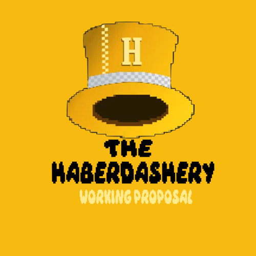

# The Haberdashery Working Proposal

  

This work proposal has been prepared for The Haberdashery DEGEN/DAO.
DegenDAO is a sufficiently decentralized DAO focused on growing the Degen and Farcaster ecosystem.  

It’s purpose is to grow capital and social value for its holders by investing in and supporting the Farcaster and Base ecosystem!.  

In the repository you will find the simple way how to build a work proposal made in streamlit a framework that you can use with Python.